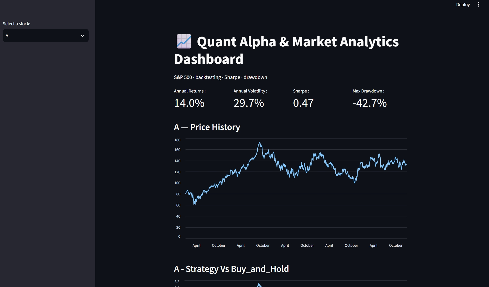
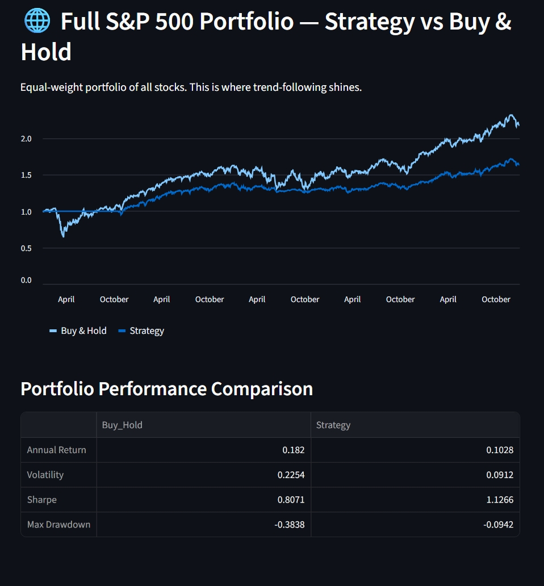
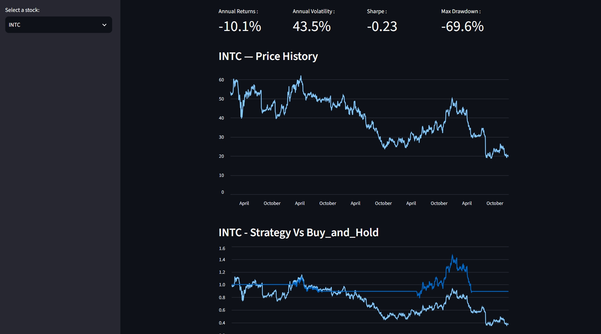

# 📈 Quant Alpha & Market Analytics Dashboard

An end-to-end quantitative research pipeline for the S&P 500 — from raw price data to an interactive backtesting dashboard. Built with Python, pandas, and Streamlit.




## Overview
This project downloads 5 years of S&P 500 price data, computes risk-adjusted performance metrics, and backtests a trend-following strategy against a buy-and-hold benchmark — all visualised in an interactive Streamlit dashboard.

## Key Features
- **Data pipeline** — scrapes the S&P 500 constituent list from Wikipedia and downloads split/dividend-adjusted prices for ~500 stocks via yfinance
- **Performance metrics** — annualised return, volatility, Sharpe ratio, and maximum drawdown
- **Backtesting engine** — a 50/200-day moving-average crossover strategy with look-ahead-bias protection (signals shifted one day)
- **Interactive dashboard** — per-stock KPIs and charts, plus a full-market portfolio backtest

## Key Finding
Across an equal-weight S&P 500 portfolio, the trend-following strategy improved the **Sharpe ratio from 0.81 to 1.13** and cut **maximum drawdown from −38% to −9%**.

The reason: diversification already removes company-specific risk, so what remains is market-wide risk. Trend-following mitigates exactly that — it moves the portfolio to cash during sustained downturns, sidestepping the 2022 bear market. On individual trending stocks the strategy underperforms, but at the portfolio level its crash protection produces a superior risk-adjusted return.



The strategy's defensive nature is clearest on declining stocks — e.g. Intel (INTC), where it cut the maximum drawdown from −70% to −40%:



## Tech Stack
Python · pandas · numpy · yfinance · Streamlit · matplotlib

## Project Structure
```
src/
  fetch_data.py   # download S&P 500 tickers + adjusted prices
  returns.py      # clean prices, compute daily returns
  metrices.py     # Sharpe, volatility, max drawdown metrics
  backtest.py     # moving-average crossover backtesting engine
  dashboard.py    # Streamlit dashboard
data/             # generated CSVs (gitignored)
assets/           # dashboard screenshots
```

## How to Run
```bash
# 1. Set up the environment
python -m venv venv
source venv/Scripts/activate      # Windows (Git Bash)
pip install -r requirements.txt

# 2. Download the data
python src/fetch_data.py

# 3. Launch the dashboard
streamlit run src/dashboard.py
```

## Methodology Notes
- **Adjusted close** prices are used so returns correctly account for splits and dividends.
- **Look-ahead bias** is avoided by shifting each trading signal forward one day — decisions use only information available at the time.
- Metrics are **annualised** using 252 trading days (return × 252, volatility × √252).

## Limitations & Future Work
- **Survivorship bias** — the universe uses *current* index members, so companies dropped from the S&P 500 are excluded.
- **No transaction costs** — the backtest does not yet model commissions or slippage, which would reduce strategy returns.
- **Planned** — a SQL analytics layer (SQLite), transaction-cost modelling, and additional strategies.